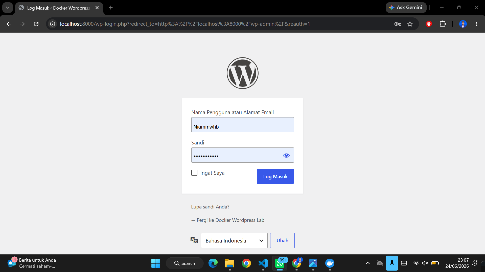
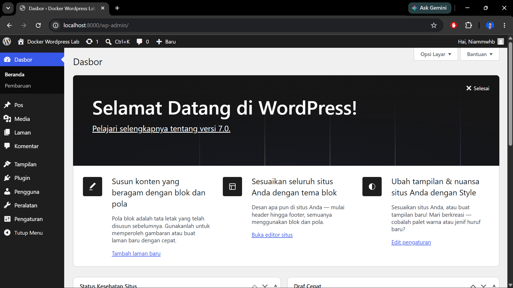
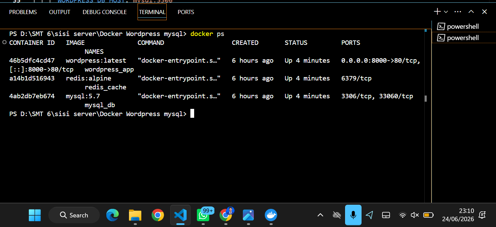
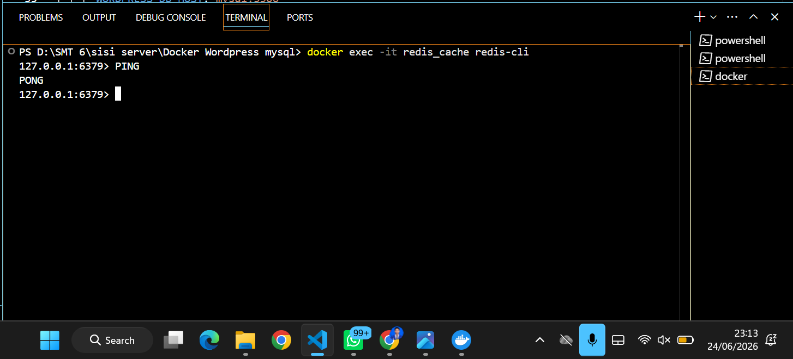
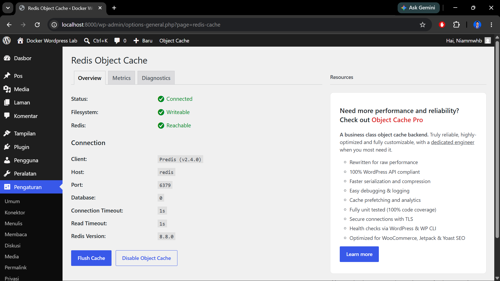
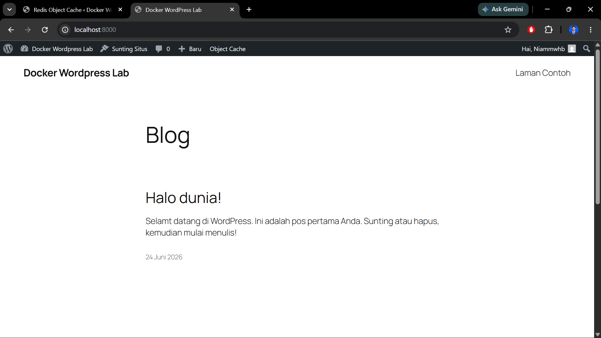

# Nama : Muhammad Ni'am Mawahib
## NIM : A11.2023.15462

## 1. Langkah Menjalankan Stack

1. Clone repository ini.
2. Jalankan perintah: `docker-compose up -d`.
3. Akses WordPress di `http://localhost:8000`.

## 2. Dokumentasi Screenshot

### A. WordPress Login

### B. WordPress Dashboard

### C. Docker Containers Running (docker ps)

### D. Redis CLI Ping Test

### E. Redis Object Cache Connected

### F. Post Page

---

## 3. Jawaban Pertanyaan

1. **Kenapa perlu volume untuk MySQL?**

Volume digunakan agar data database tetap tersimpan secara permanen meskipun container MySQL dihentikan, dihapus, atau dibuat ulang.

- Tanpa volume container akan hilang jika dihapus, seluruh database ikut hilang.
- Dengan volume Data disimpan di luar container sehingga tetap aman dan dapat digunakan kembali saat container dijalankan lagi.

Contoh:
volumes: - mysql_data:/var/lib/mysql

2. **Apa fungsi `depends_on`?**
   Untuk mengatur urutan startup service. Memastikan MySQL dan Redis berjalan lebih dulu sebelum WordPress mencoba melakukan koneksi.

3. **Bagaimana cara WordPress container connect ke MySQL?** Melalui Docker Networking, WordPress menggunakan nama service `mysql` (sebagai hostname) yang didefinisikan di docker-compose.yml.

4. **Apa keuntungan pakai Redis untuk WordPress?** Mempercepat loading website dengan menyimpan object cache di RAM, sehingga mengurangi query langsung ke database MySQL.
