# FINAL PROJECT REPORT

## Simple LMS Backend API

---

# Identitas

**Nama** : Muhammad Ni'am Mawahib

**NIM** : A11.2023.15462

**Kelas** : A11.4602

**Repository** :
https://github.com/Niammwhb/Pemro-Sisi-Server/tree/main/Final-Project%20Simple%20LMS

---

# Deskripsi Project

Project ini merupakan pengembangan backend Learning Management System (LMS) menggunakan framework Django dan Django Ninja sebagai REST API Framework. Sistem dirancang untuk mengelola proses pembelajaran secara digital dengan menerapkan arsitektur RESTful API, JWT Authentication, Role Based Access Control (RBAC), serta berbagai teknologi pendukung seperti Docker, PostgreSQL, Redis, MongoDB, RabbitMQ, Celery, dan Flower.

Selain fitur utama LMS, project ini juga dikembangkan dengan beberapa fitur tambahan untuk meningkatkan performa, keamanan, monitoring, dan pengalaman pengguna, seperti Dashboard Statistik, Course Announcement, Redis Caching, Background Task menggunakan Celery, Activity Logging MongoDB, serta Health Check Endpoint.

---

# Fitur Dasar yang Sudah Berjalan

Berikut merupakan fitur utama yang telah berhasil diimplementasikan pada project ini.

- Docker Compose Environment
- Django Ninja REST API
- PostgreSQL Database
- JWT Authentication
- User Authentication (Login & Register)
- Role Based Access Control (Admin, Instructor, Student)
- User Management
- Category Management
- Course Management
- Lesson Management
- Enrollment Management
- Progress Tracking
- Django Admin
- Swagger / OpenAPI Documentation

---

# Fitur Tambahan yang Dipilih

Fitur tambahan yang dikembangkan pada project ini meliputi:

1. Dashboard Statistik

   - Menampilkan jumlah User
   - Jumlah Admin
   - Jumlah Instructor
   - Jumlah Student
   - Jumlah Course
   - Jumlah Category
   - Jumlah Lesson
   - Jumlah Enrollment
   - Jumlah Progress
   - Jumlah Announcement

2. Course Announcement

   - Instructor dapat membuat pengumuman pada setiap Course.
   - Announcement dapat ditampilkan berdasarkan Course.

3. Redis Course Caching

   - Menyimpan hasil query Course pada Redis untuk meningkatkan performa.

4. Activity Logging MongoDB

   - Menyimpan aktivitas penting pengguna seperti Login dan Create Course.

5. Celery Background Task

   - Menjalankan proses asynchronous menggunakan Celery.

6. RabbitMQ Message Broker

   - Digunakan sebagai message broker untuk Celery.

7. Flower Monitoring

   - Monitoring task Celery secara realtime.

8. Health Check Endpoint

   - Menampilkan status API dan service yang sedang berjalan.

9. Consistent API Response

   - Response API dibuat lebih konsisten dan mudah digunakan.

10. Dashboard API
    - Endpoint baru untuk menampilkan statistik keseluruhan sistem LMS.

---

# Penjelasan Implementasi

## 1. Authentication

Sistem menggunakan JWT Authentication sehingga setiap pengguna yang berhasil login akan memperoleh Access Token yang digunakan untuk mengakses endpoint yang membutuhkan autentikasi.

---

## 2. Role Based Access Control

Terdapat tiga role utama yaitu:

- Admin
- Instructor
- Student

Setiap role memiliki hak akses yang berbeda terhadap endpoint yang tersedia.

---

## 3. Dashboard Statistik

Dashboard Statistik merupakan fitur tambahan yang dibuat untuk memberikan informasi ringkas mengenai kondisi sistem secara realtime.

Dashboard menampilkan:

- Total User
- Total Admin
- Total Instructor
- Total Student
- Total Course
- Total Category
- Total Lesson
- Total Enrollment
- Total Progress
- Total Announcement

Endpoint:

```
GET /api/dashboard
```

---

## 4. Redis Cache

Redis digunakan untuk menyimpan cache data Course sehingga proses pengambilan data menjadi lebih cepat.

---

## 5. MongoDB Activity Logging

MongoDB digunakan sebagai penyimpanan log aktivitas pengguna seperti:

- Login
- Register
- Create Course
- Update Course
- Delete Course

---

## 6. Celery & RabbitMQ

Celery digunakan untuk menjalankan background task, sedangkan RabbitMQ berfungsi sebagai Message Broker.

---

## 7. Flower

Flower digunakan untuk melakukan monitoring seluruh task Celery secara realtime.

---

# Cara Menjalankan Project

## 1. Clone repository

```bash
git clone https://github.com/Niammwhb/Pemro-Sisi-Server.git
```

---

## 2. Masuk ke folder project

```bash
cd final-project Simple LMS
```

---

## 3. Copy environment

```bash
cp .env.example .env
```

---

## 4. Build Docker

```bash
docker compose build
```

---

## 5. Menjalankan seluruh service

```bash
docker compose up -d
```

---

## 6. Migration

```bash
docker compose exec web python manage.py migrate
```

---

## 7. Create Superuser

```bash
docker compose exec web python manage.py createsuperuser
```

---

## 8. Akses aplikasi

Swagger

```
http://localhost:8001/api/docs
```

Admin

```
http://localhost:8001/admin
```

Flower

```
http://localhost:5555
```

RabbitMQ

```
http://localhost:15672
```

---

# Akun Demo

## Admin

Username

```
Niammwhb-admin
```

Password

```
P@ssword123
```

---

## Instructor

Username

```
Niammwhb-instructor
```

Password

```
123456
```

---

## Student

Username

```
Niammwhb-student
```

Password

```
123456
```

---

# Endpoint Penting

## Authentication

```
POST /api/auth/register
POST /api/auth/login
GET  /api/auth/me
PUT  /api/auth/me
```

---

## Dashboard

```
GET /api/dashboard
```

---

## Course

```
GET    /api/courses
POST   /api/courses
GET    /api/courses/{id}
PATCH  /api/courses/{id}
DELETE /api/courses/{id}
```

---

## Health Check

```
GET /api/courses/health
```

---

# Screenshot / Bukti Pengujian

Semua dokumentasi hasil screenshot berada pada folder `img/`.

## 1. Project Structure

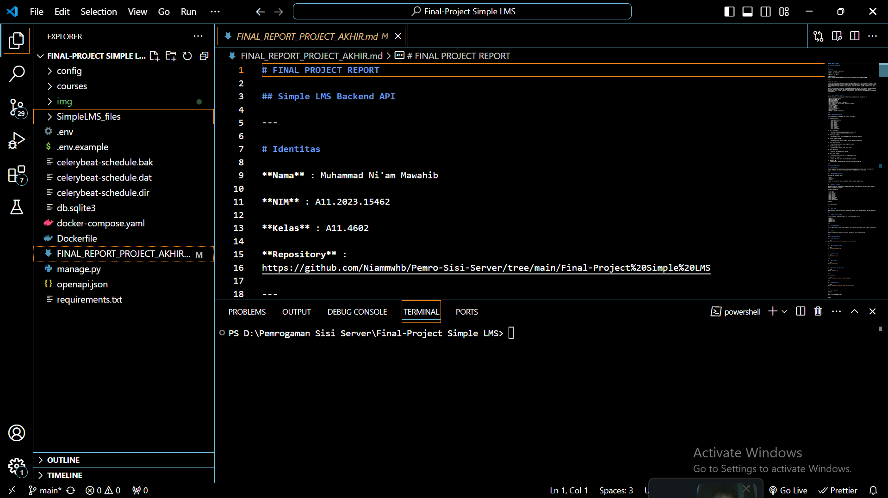

## 2. Docker Running

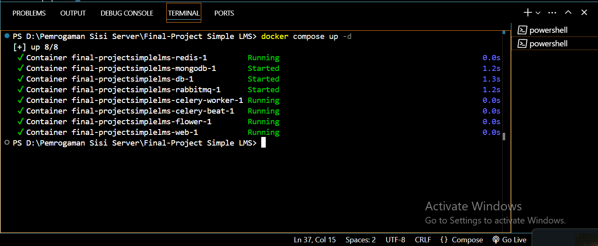

## 3. Docker Containers

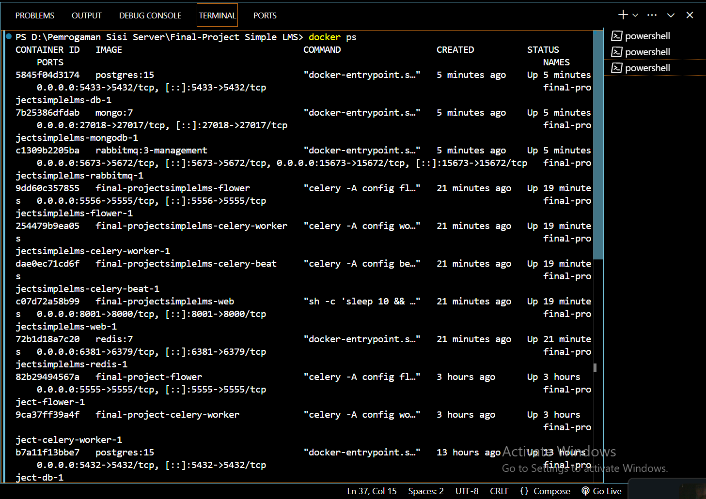

## 4. Swagger Home

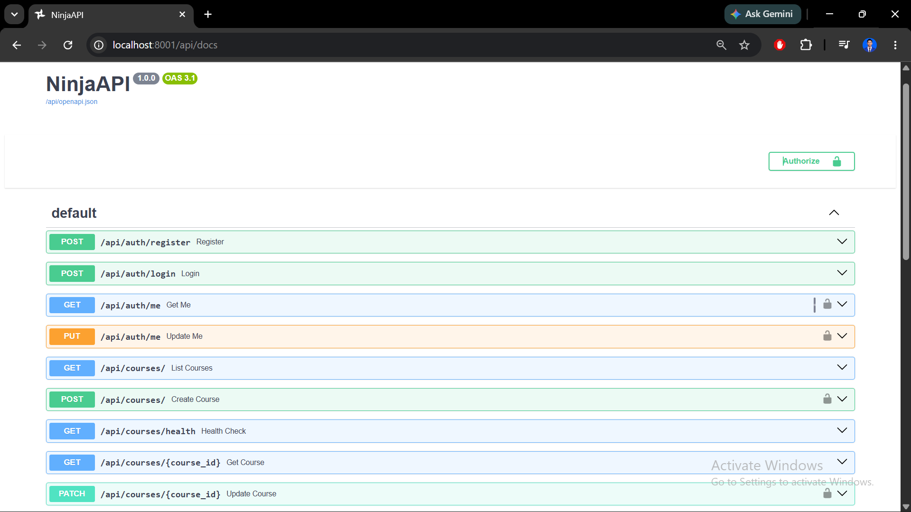 (img/img4-Swagger home.png)

## 5. Register API

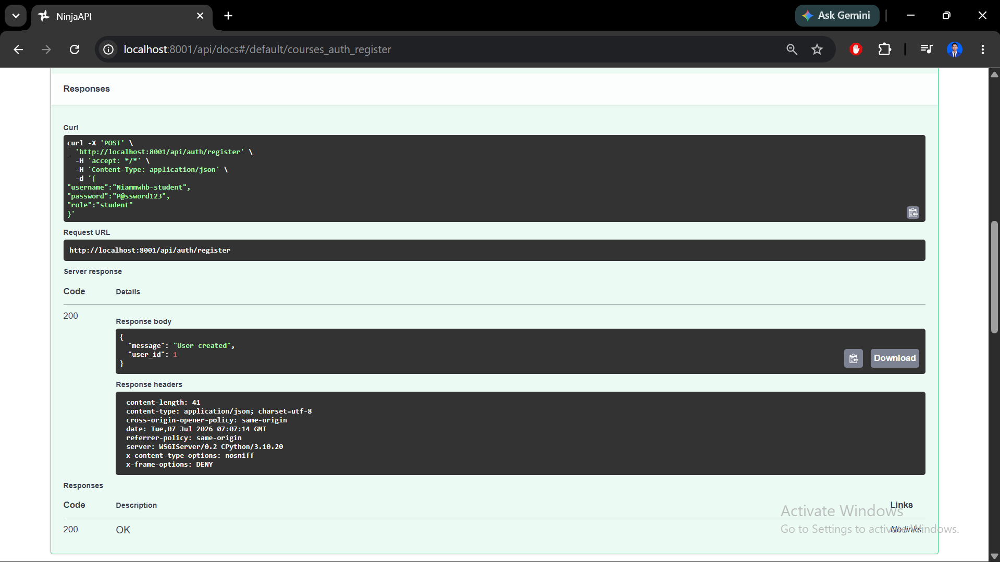

## 6. Login JWT

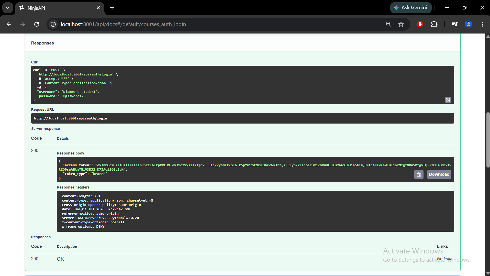

## 7. Dashboard API

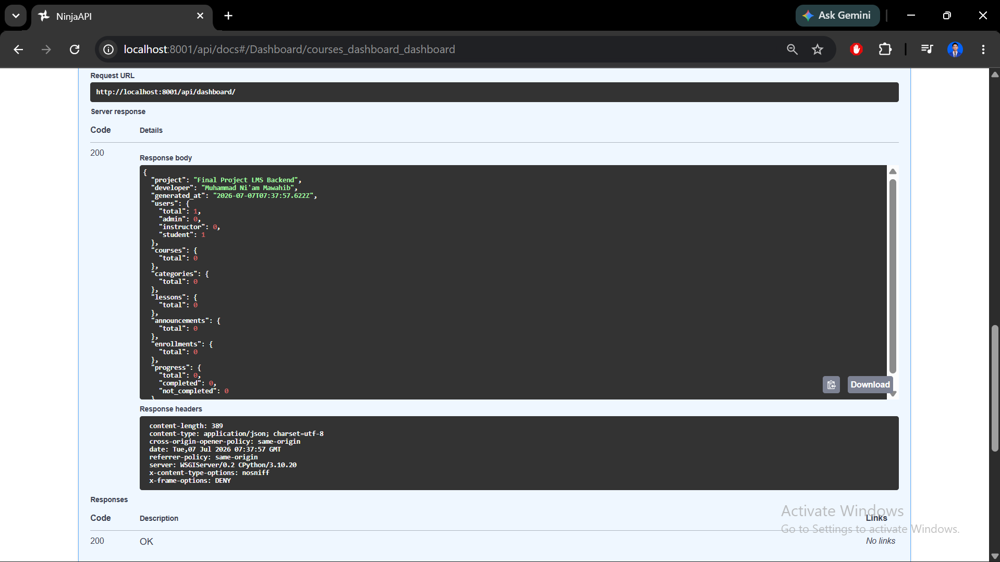

## 8. Course List


## 9. Django Admin

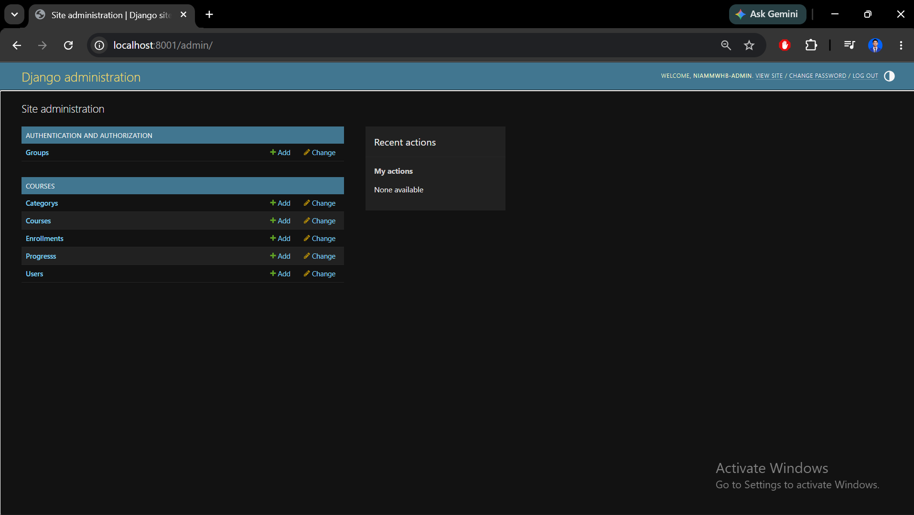

## 10. Flower Dashboard

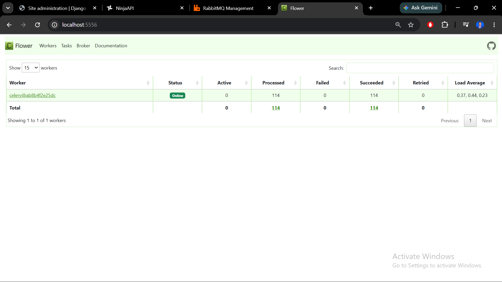

## 11. RabbitMQ Dashboard

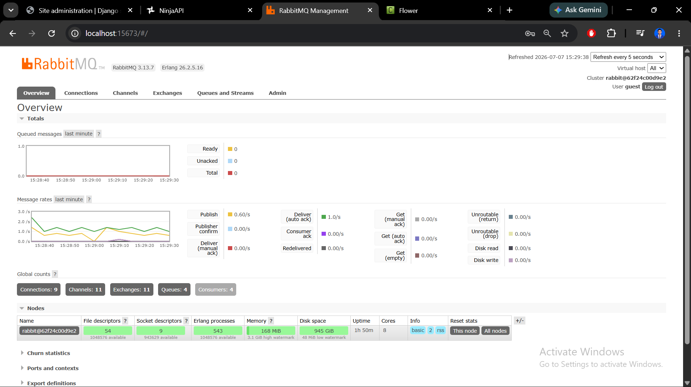

## 12. MongoDB Log

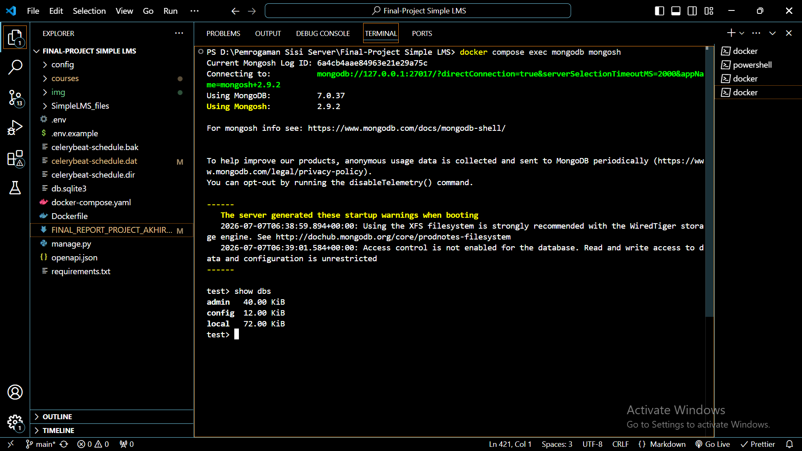

## 13. Redis Cache


## 14. Django Admin


## 15. PostgreSQL

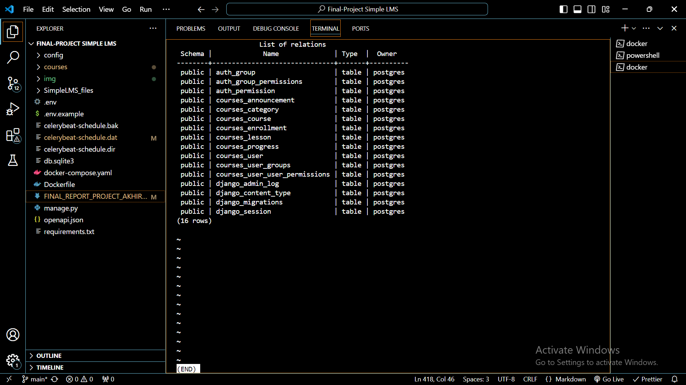

---

# Kendala dan Solusi

## Kendala

- Docker Desktop gagal berjalan karena Page File Windows terlalu kecil.
- Port 8000 bentrok dengan container WordPress.
- MongoDB belum membuat collection karena belum ada aktivitas yang dicatat.
- Beberapa migration belum dijalankan sehingga tabel belum terbentuk.
- Error autentikasi JWT saat token belum digunakan pada endpoint yang membutuhkan login.

## Solusi

- Menambah ukuran Virtual Memory (Paging File) Windows.
- Mengubah port aplikasi menjadi 8001.
- Menjalankan migration sebelum create superuser.
- Menggunakan Docker Compose untuk menjalankan seluruh service.
- Melakukan pengujian endpoint menggunakan Swagger.

---

# Kesimpulan

Project ini berhasil mengimplementasikan backend Learning Management System menggunakan Django Ninja dengan arsitektur REST API. Seluruh fitur utama seperti Authentication, Role Based Access Control, Course Management, Enrollment, Progress Tracking, Swagger Documentation, serta integrasi Docker berhasil berjalan dengan baik.

Selain fitur dasar, project juga dikembangkan dengan berbagai fitur tambahan seperti Dashboard Statistik, Redis Caching, MongoDB Activity Logging, Celery Background Task, RabbitMQ, Flower Monitoring, dan Health Check Endpoint sehingga menghasilkan backend LMS yang lebih modern, terstruktur, scalable, dan siap digunakan sebagai dasar pengembangan sistem pembelajaran berbasis web.
