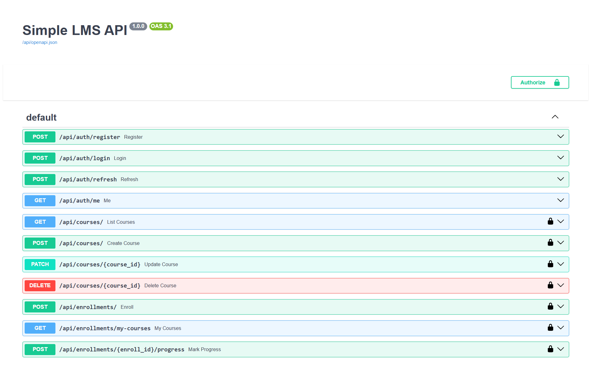
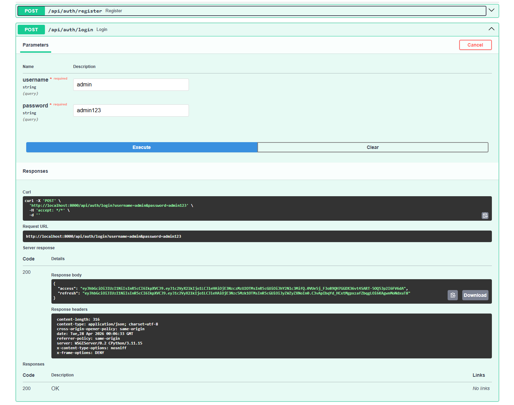
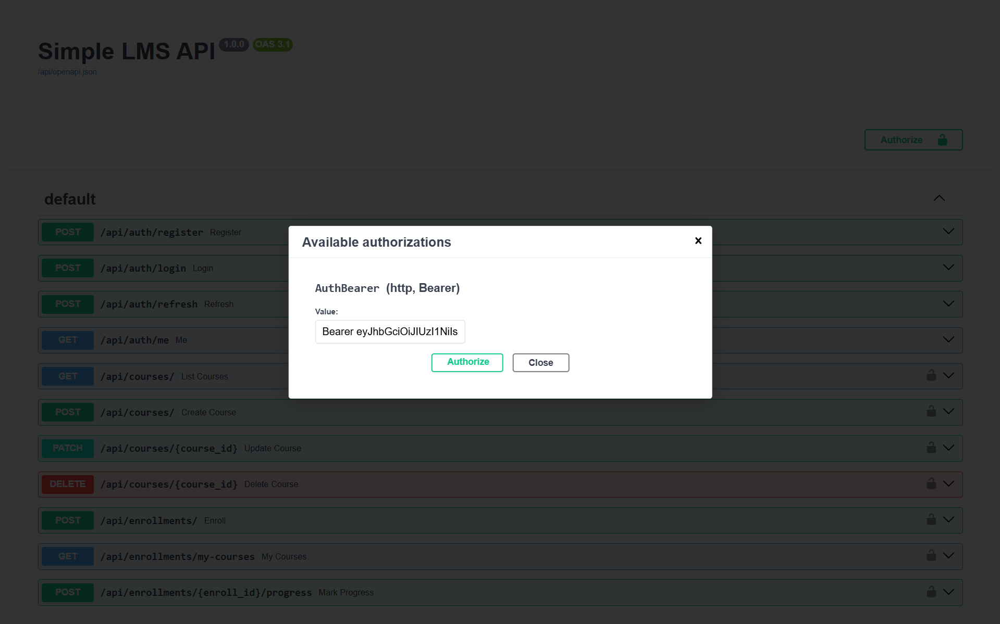
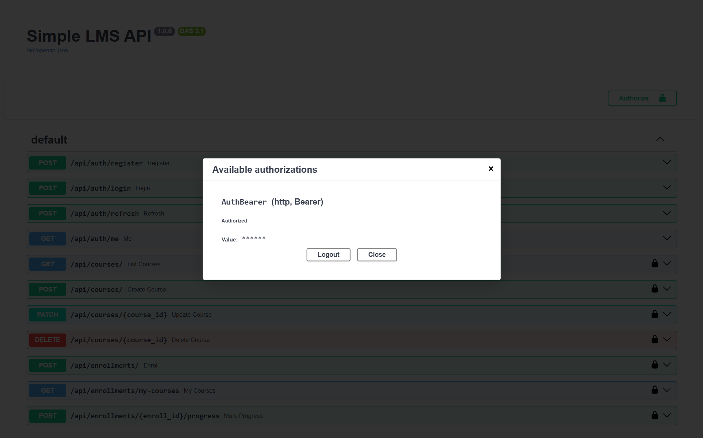
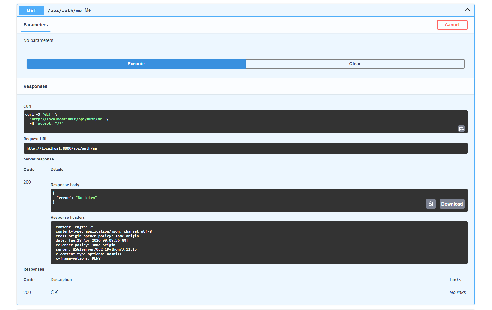

# Progress-3 Simple LMS - Reat API

**Nama:** Muhammad Ni'am Mawahib  
**NIM:** A11.2023.15462

# Simple LMS API

REST API untuk sistem Learning Management System (LMS) menggunakan Django Ninja dengan JWT Authentication dan Role-Based Access Control (RBAC).

---

## Features

- JWT Authentication (Access & Refresh Token)
- Role-Based Access Control (Admin, Instructor, Student)
- Course Management (CRUD)
- Enrollment System
- Progress Tracking
- Pagination Support
- Swagger API Documentation

---

## Roles

| Role       | Permissions                     |
| ---------- | ------------------------------- |
| Admin      | Full access (CRUD semua course) |
| Instructor | Create & manage own courses     |
| Student    | Enroll & track progress         |

---

## Authentication Flow

1. Login untuk mendapatkan access token dan refresh token
2. Gunakan access token untuk mengakses endpoint protected
3. Jika token expired, gunakan refresh token untuk mendapatkan token baru

---

## API Endpoints

### Authentication

- POST /api/auth/register
- POST /api/auth/login
- POST /api/auth/refresh
- GET /api/auth/me
- PUT /api/auth/me

### Courses

- GET /api/courses
- GET /api/courses/{id}
- POST /api/courses (Instructor)
- PATCH /api/courses/{id} (Owner/Admin)
- DELETE /api/courses/{id} (Admin)

### Enrollments

- POST /api/enrollments
- GET /api/enrollments/my-courses
- POST /api/enrollments/{id}/progress

---

## Pagination Example

Request:

```
GET /api/courses?limit=10&offset=0
```

Response:

```json
{
  "count": 100,
  "results": []
}
```

---

## API Documentation

Swagger UI tersedia di:
http://localhost:8000/api/docs

---

## Screenshots

### Swagger Documentation



### Login (JWT Token)



### Authorize Token




### Get Current User



---

## Installation

### Clone Repository

```
git clone https://github.com/Niammwhb/Pemro-Sisi-Server
cd Progress-3 Simple LMS - Reat API
```

### Run dengan Docker

```
docker-compose up --build
```

### Migration

```
docker-compose exec web python manage.py migrate
```

---

## Testing

API dapat diuji menggunakan:

- Swagger UI
- Postman Collection

---

## Project Structure

```
api/
lms/
config/
docker-compose.yml
requirements.txt
README.md
img/
```

---

## Author

Muhammad Ni'am Mawahib

---

## Conclusion

Project ini mengimplementasikan REST API lengkap dengan authentication, authorization, dan best practices backend modern menggunakan Django Ninja.
