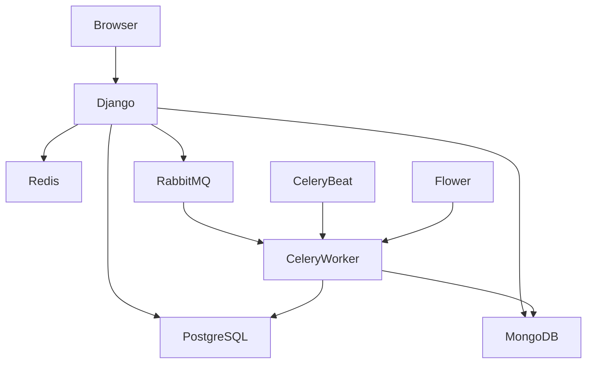
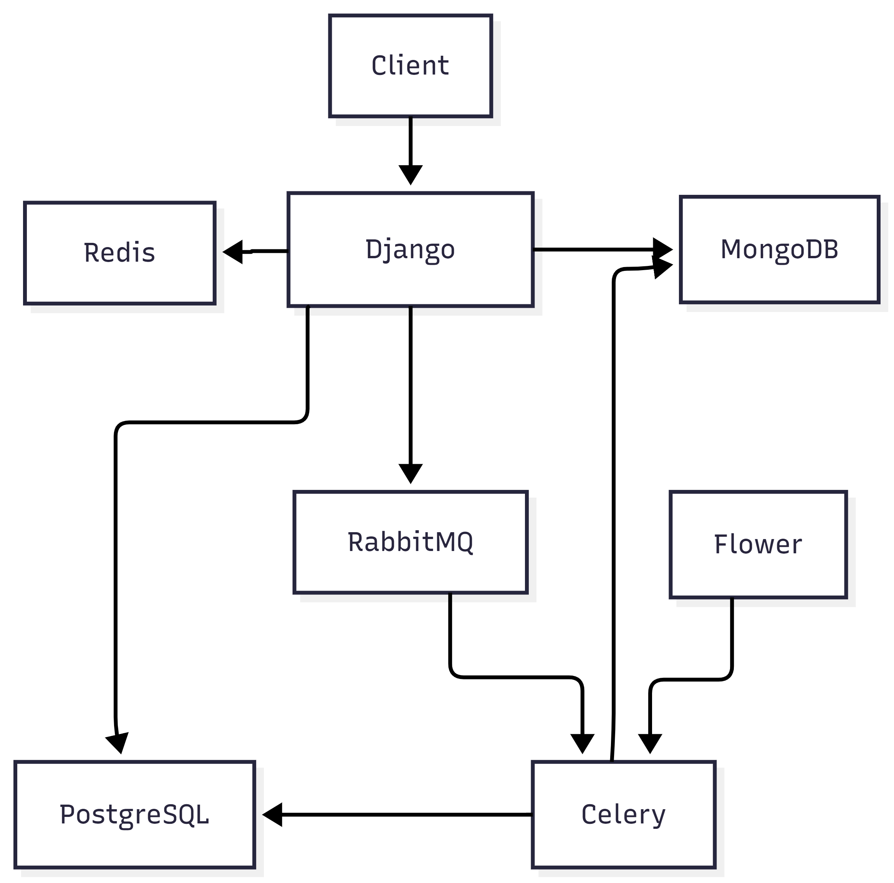
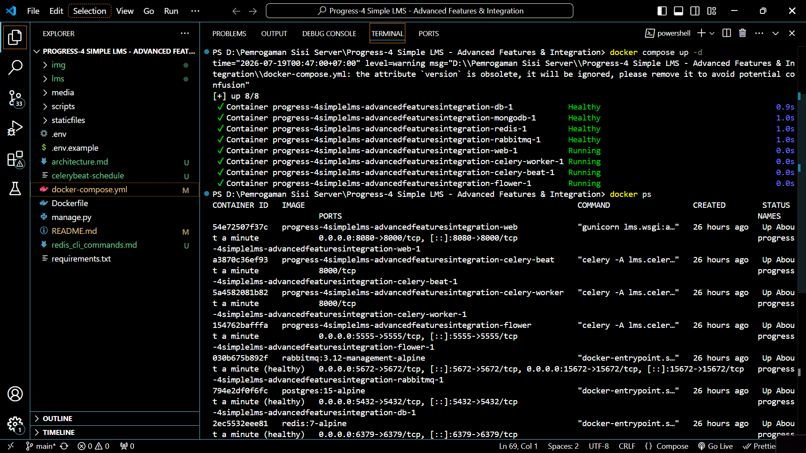
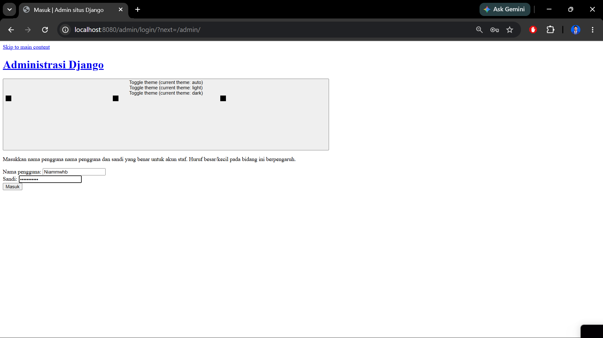
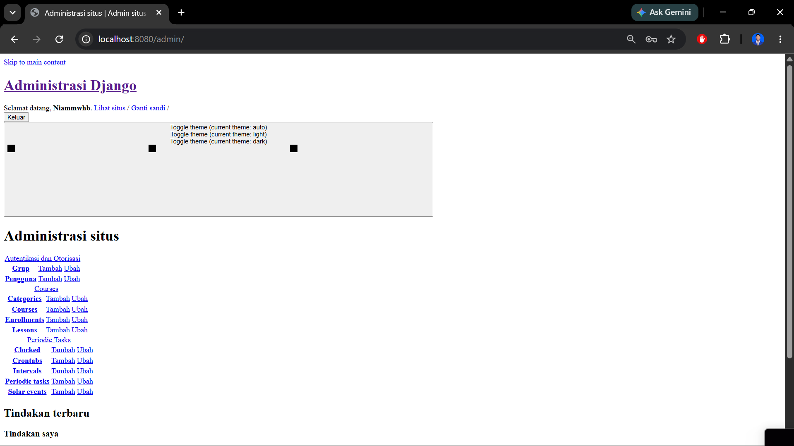
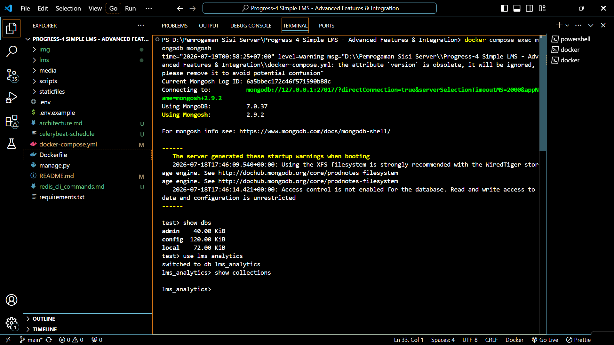
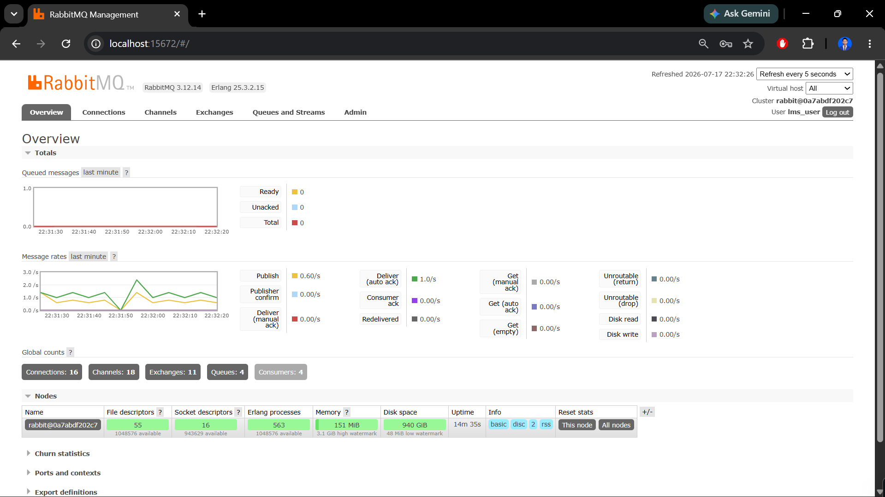
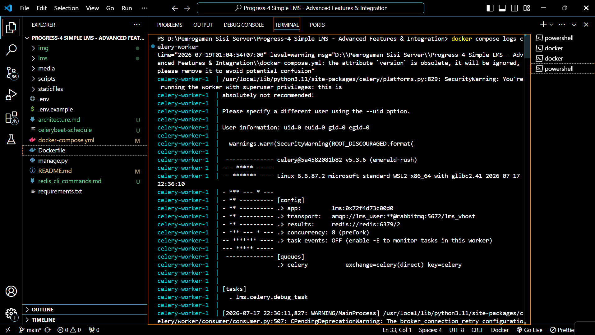
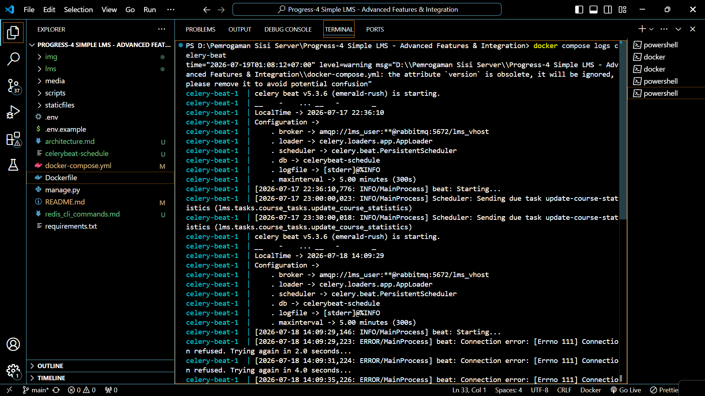
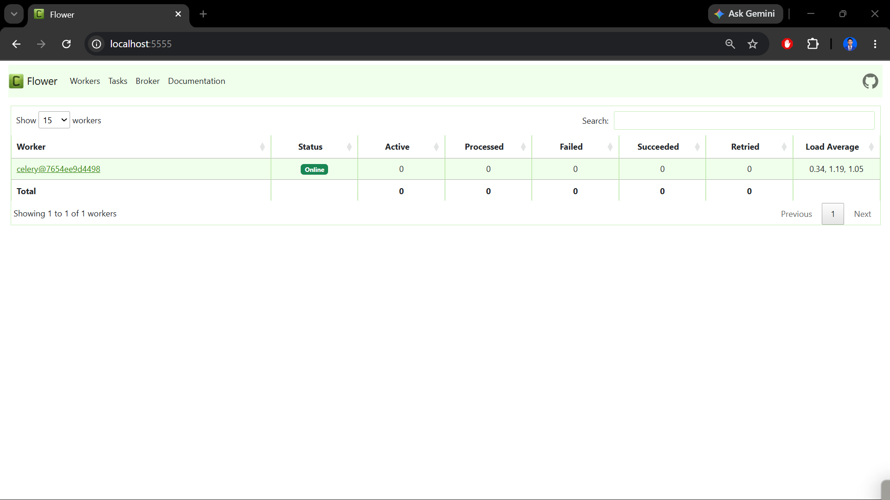

# Progress-4 Simple LMS - Advanced Features & Integration

**Nama:** Muhammad Ni'am Mawahib  
**NIM:** A11.2023.15462

# 📸 Dokumentasi Implementasi

Project ini mengintegrasikan **Redis**, **MongoDB**, **RabbitMQ**, **Celery**, dan **Flower** untuk meningkatkan performa dan skalabilitas aplikasi Simple LMS.

---

# 🏗️ 1. Architecture Diagram

Arsitektur sistem menunjukkan bagaimana setiap service saling berkomunikasi.

- Django sebagai aplikasi utama
- PostgreSQL sebagai database relasional
- Redis sebagai cache
- MongoDB sebagai document database
- RabbitMQ sebagai message broker
- Celery Worker menjalankan asynchronous task
- Celery Beat menjalankan scheduled task
- Flower digunakan untuk monitoring Celery



<p align="center">

</p>

---

# 🐳 2. Docker Compose Services

Project dijalankan menggunakan Docker Compose yang terdiri dari beberapa service.

Service yang digunakan:

- web (Django)
- db (PostgreSQL)
- redis
- mongodb
- rabbitmq
- celery-worker
- celery-beat
- flower

<p align="center">

</p>

Seluruh container berhasil dijalankan tanpa error.

---

# 🌐 3. Django Application

Aplikasi Django berhasil dijalankan menggunakan Docker.

URL

```
http://localhost:8080
```

<p align="center">

</p>

---

# 👨‍💻 4. Django Admin

Django Admin digunakan untuk mengelola data aplikasi.

Melalui halaman admin dapat dilakukan pengelolaan:

- User
- Course
- Category
- Lesson
- Enrollment
- Progress

URL

```
http://localhost:8080/admin
```

<p align="center">

</p>

---

# ⚡ 5. Redis Integration

Redis digunakan sebagai **Caching Layer** untuk meningkatkan performa aplikasi.

Implementasi yang dilakukan meliputi:

- Course List Caching
- Course Detail Caching
- Cache Invalidation
- Rate Limiting (60 request/menit)

Strategi caching yang digunakan:

```text
Request
    │
    ▼
Redis Cache
    │
 ┌──┴───┐
 │      │
Hit    Miss
 │      │
 │   PostgreSQL
 │      │
 └──────┘
    │
Response
```

Pada project ini Redis dijalankan sebagai service terpisah melalui Docker Compose dan digunakan oleh aplikasi Django sebagai media penyimpanan cache.

---

# 🍃 6. MongoDB Integration

MongoDB digunakan sebagai **Document Database**.

Implementasi meliputi:

- Activity Log Collection
- Learning Analytics Collection
- Aggregation Query untuk Reporting

MongoDB dijalankan sebagai service Docker.

<p align="center">

</p>

MongoDB menyimpan data yang tidak membutuhkan relasi kompleks sehingga lebih efisien untuk log aktivitas pengguna.

---

# 🐇 7. RabbitMQ

RabbitMQ digunakan sebagai **Message Broker**.

Fungsinya adalah mengirim task dari Django menuju Celery Worker.

Task yang dikirim meliputi:

- send_enrollment_email
- generate_certificate
- export_course_report
- update_course_statistics

<p align="center">

</p>

Dashboard RabbitMQ menunjukkan queue dan status koneksi message broker.

---

# ⚙️ 8. Celery Worker

Celery Worker bertugas menjalankan asynchronous task.

Task yang dijalankan antara lain:

- Send Enrollment Email
- Generate Certificate
- Export Course Report
- Update Course Statistics

Task Flow

```text
Student Enroll
      │
      ▼
Save Database
      │
      ▼
RabbitMQ Queue
      │
      ▼
Celery Worker
      │
      ├── Send Email
      ├── Generate Certificate
      ├── Export CSV
      └── Update Statistics
```

<p align="center">

</p>

---

# ⏰ 9. Celery Beat

Celery Beat digunakan untuk menjalankan Scheduled Task.

Task yang dijalankan secara periodik:

- update_course_statistics
- analytics update
- scheduled report

<p align="center">

</p>

Celery Beat akan mengirim task ke Celery Worker sesuai jadwal yang telah ditentukan.

---

# 🌸 10. Flower Monitoring

Flower digunakan untuk memonitor seluruh Celery Worker.

Monitoring meliputi:

- Active Worker
- Running Task
- Success Task
- Failed Task
- Scheduled Task

URL

```
http://localhost:5555
```

<p align="center">

</p>

---

# 📚 Redis CLI Documentation

Beberapa perintah Redis yang digunakan dalam project:

Masuk ke Redis

```bash
docker compose exec redis redis-cli
```

Melihat semua key

```bash
KEYS *
```

Melihat isi cache

```bash
GET course_list
```

Menghapus cache

```bash
DEL course_list
```

Menghapus seluruh cache

```bash
FLUSHALL
```

---

# 📋 Deliverables

## Redis Integration

- ✅ Course List Caching
- ✅ Course Detail Caching
- ✅ Cache Invalidation Strategy
- ✅ Rate Limiting (60 Request/Minute)

## MongoDB Integration

- ✅ Activity Log Collection
- ✅ Learning Analytics Collection
- ✅ Aggregation Query

## Celery Tasks

- ✅ send_enrollment_email
- ✅ generate_certificate
- ✅ update_course_statistics
- ✅ export_course_report

## Docker Compose

- ✅ Django
- ✅ PostgreSQL
- ✅ Redis
- ✅ MongoDB
- ✅ RabbitMQ
- ✅ Celery Worker
- ✅ Celery Beat

## Monitoring

- ✅ Flower Dashboard
- ✅ Redis CLI Documentation

## Documentation

- ✅ Architecture Diagram
- ✅ Caching Strategy
- ✅ Task Flow Documentation

---
