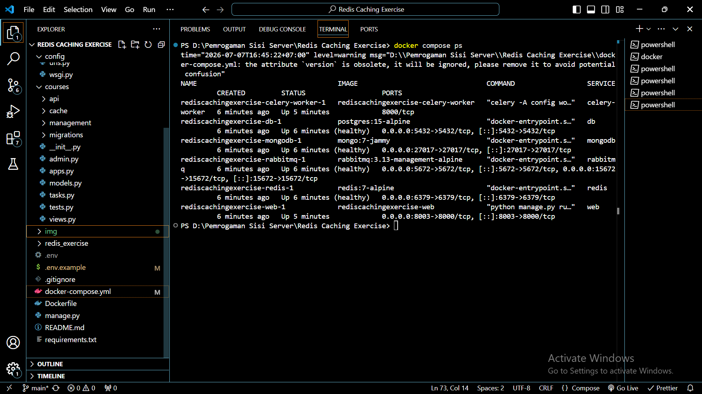
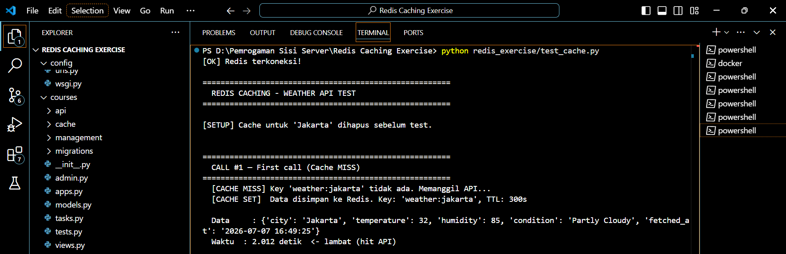
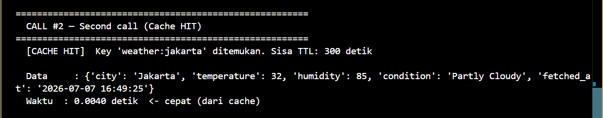
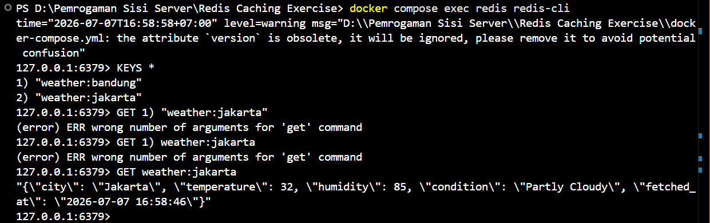
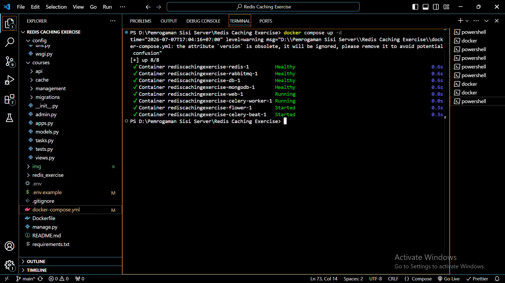

# Redis Caching Exercise

**Nama:** Muhammad Ni'am Mawahib  
**NIM:** A11.2023.15462

---

# Deskripsi Project

Project ini merupakan implementasi **Redis Cache** menggunakan Python untuk menyimpan hasil pemanggilan API sehingga request yang sama tidak perlu memanggil API berulang kali.

Redis digunakan sebagai **in-memory cache** untuk mengurangi waktu response dari sekitar **2 detik** menjadi hanya beberapa **milidetik** pada request berikutnya.

---

# Learning Objectives

- Memahami konsep caching menggunakan Redis.
- Memahami operasi dasar Redis (`GET`, `SET`, `EXPIRE`).
- Mengurangi response time API menggunakan cache.
- Memahami implementasi Redis pada aplikasi Python.

---

# Teknologi yang Digunakan

- Python 3
- Redis
- Docker Compose
- Django
- PostgreSQL
- RabbitMQ
- Celery
- MongoDB

---

# Cara Menjalankan Project

## 1. Clone Repository

```bash
git clone <https://github.com/Niammwhb/Pemro-Sisi-Server>
cd Redis-Caching-Exercise
```

---

## 2. Copy Environment

```bash
copy .env.example .env
```

---

## 3. Jalankan Docker

```bash
docker compose up -d --build
```

---

## 4. Pastikan Semua Service Berjalan

```bash
docker compose ps
```

---

## 5. Jalankan Redis Cache Test

```bash
python redis_exercise/test_cache.py
```

---

# Implementasi Redis Cache

Alur kerja cache adalah sebagai berikut.

```
Request

↓

Redis GET

↓

Cache Ada ?

↓

YA
↓

Return dari Redis

↓

TIDAK

↓

Call API

↓

Simpan ke Redis

↓

Return Hasil
```

---

# Redis Commands

### GET

Mengambil data dari cache.

```python
redis_client.get(cache_key)
```

Redis CLI

```bash
GET weather:jakarta
```

---

### SET

Menyimpan data ke Redis.

```python
redis_client.set(...)
```

---

### EXPIRE

Mengatur masa berlaku cache selama 300 detik.

```python
redis_client.setex(
    cache_key,
    300,
    data
)
```

Setara dengan

```bash
SET weather:jakarta {...}

EXPIRE weather:jakarta 300
```

---

# Hasil Pengujian

## 1. Docker & Redis Running

Semua service Docker berhasil dijalankan dan Redis berada pada status **Healthy**.



---

## 2. First Call (Cache MISS)

Request pertama belum memiliki cache sehingga aplikasi memanggil API secara langsung.

Response time sekitar **2 detik**.



---

## 3. Second Call (Cache HIT)

Request kedua mengambil data langsung dari Redis sehingga response menjadi jauh lebih cepat.

Response time sekitar **0.01 detik**.



---

## 4. Redis CLI

Verifikasi cache menggunakan Redis CLI.

Perintah yang digunakan:

```bash
PING

KEYS *

GET weather:jakarta

TTL weather:jakarta
```

Screenshot:



---

## 5. Docker Compose

Semua container berhasil dijalankan menggunakan Docker Compose.



---

# Perbandingan Response Time

## | Request : Waktu |

| First Call : ±2.00 s |
| Second Call : ±0.01 s |

Penggunaan Redis berhasil mempercepat response lebih dari **99%** dibandingkan request pertama.

---

# Cache Expiry

Cache disimpan selama:

```
300 detik
```

atau

```
5 menit
```

Setelah waktu tersebut habis, Redis akan menghapus cache secara otomatis sehingga request berikutnya kembali mengambil data dari API.

---

# Keuntungan Menggunakan Redis Cache

- Mengurangi response time aplikasi.
- Mengurangi request ke API eksternal.
- Mengurangi beban server.
- Meningkatkan performa aplikasi.
- Menghemat penggunaan bandwidth.
- Memberikan pengalaman pengguna yang lebih baik.

---

# Kapan Sebaiknya Tidak Menggunakan Cache

Cache tidak disarankan apabila:

- Data harus selalu real-time.
- Data berubah sangat sering.
- Data bersifat sensitif.
- Konsistensi data lebih penting dibandingkan kecepatan akses.

---

# Kesimpulan

Implementasi Redis Cache berhasil meningkatkan performa aplikasi dengan menyimpan hasil API pada Redis selama 300 detik.
Request pertama melakukan pemanggilan API sehingga membutuhkan waktu sekitar 2 detik. Setelah data tersimpan di Redis, request berikutnya langsung mengambil data dari cache sehingga response menjadi jauh lebih cepat.
Penggunaan Redis merupakan solusi yang efektif untuk meningkatkan performa aplikasi dan mengurangi beban server.
